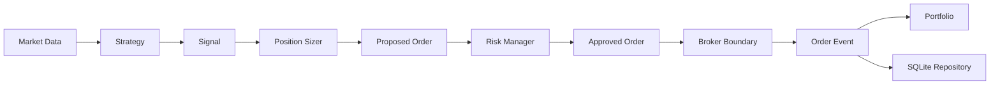

# OKX Quant MVP

一个以安全边界、可复现回测和故障恢复为核心的 OKX 量化交易工程基线。

项目当前支持离线回测、公共行情观察、确定性 Shadow Replay、只读连续 Shadow，以及经过
严格门禁的 OKX Demo SPOT/cash 限价单流程。它不支持实盘交易，也不应被描述为
production-ready 或 live-trading-ready。

> 风险声明：本项目仅用于工程研究和 OKX 模拟盘验证，不构成投资建议。默认不要放入任何
> 实盘凭证；`ALLOW_LIVE_TRADING` 必须保持为 `false`。

## 当前状态

| 项目 | 状态 |
|---|---|
| 当前版本 | `0.3.0` |
| Git 基线 | 首次审计提交已建立并推送到 `main` |
| Safety / Correctness | Phase 0/1 已完成 |
| Performance | Phase 2 已封板，`STOP_PHASE_2_PERFORMANCE_WORK` |
| Engineering Baseline | Phase 3A 已完成 |
| CI Integration | Phase 3B 已完成 |
| First Commit Safety Audit | Phase 3C 已完成，`BLOCKER=0`、`P1=0` |
| 本地完整质量门 | 703/703 tests、80/80 security smoke，通过 |
| 干净 clone 基线 | 698/698 tests、80/80 security smoke，通过 |
| GitHub Actions | 配置 Windows 与 Ubuntu 矩阵；远端运行结果不在本文中静态宣称 |
| 实盘交易 | 不支持，代码和配置均 fail closed |

本地测试数比干净 clone 多 5 个，是因为本地保留了不进入 Git 历史的退役运营模块及其专用
测试。提交后的仓库基线不包含这些内部材料。

## 核心能力

- 配置驱动：YAML 与环境变量合并，环境变量优先。
- 策略注册：`buy_and_hold`、`moving_average_cross`、`vwap_mean_reversion`。
- 回测：CSV 或 OKX 公共 REST 历史 K 线、动态交易规则、手续费、滑点、风控和报告输出。
- 市场观察：公共 WebSocket 只读观察，不创建订单。
- VWAP Shadow：公共行情连续观察和本地 SQLite 状态恢复，不访问私有 API、不提交订单。
- Demo 安全门：账户同步、REST 对账、私有状态检查、Proposal、状态令牌和一次性提交授权。
- 提交恢复：以 `clOrdId` 查询未知结果；禁止盲目重发或替换订单。
- 存储：SQLite、版本化 migration、备份校验、迁移计划绑定和故障恢复。
- 工程质量：Ruff、Mypy strict、Pytest、安全 smoke、Windows/Ubuntu CI。
- 研究工具：持久化画像、durability 实验和策略计算画像；不在 CI 中运行 benchmark。

## 架构概览



`TradingEngine` 只依赖领域接口，不直接知道 OKX、REST、WebSocket、CLI 或环境变量。
`app/bootstrap.py` 是组合根；交易所、数据库和具体 Broker 在这里组装。

## 安全边界

- 受控写入只允许 `BTC-USDT`、SPOT、`tdMode=cash`、LIMIT、long-only Demo 路径。
- 所有 OKX 私有请求固定发送 `x-simulated-trading: 1`。
- Demo 下单和撤单需要由受控服务签发、与环境绑定的一次性授权。
- Proposal 必须经过预检、私有状态复核和原子 submission fence。
- 超时或连接中断后只允许按 `ordId` / `clOrdId` 只读恢复；未知状态保持冻结。
- 禁止 SWAP 实盘、杠杆、借贷、资金划转、充值、提现和账户模式修改。
- 测试只使用临时数据库、Fake Broker 和本地故障注入 adapter。
- `.env`、数据库、日志、benchmark 产物和内部审计材料均被 Git 忽略。

完整约束见 [docs/SAFETY_CONTRACT.md](docs/SAFETY_CONTRACT.md)。

## 环境要求

- Python 3.11 或 3.12；CI 固定 Python 3.12。
- [uv](https://docs.astral.sh/uv/)。
- Windows、Linux 或 macOS；自动化 CI 当前覆盖 Windows 与 Ubuntu。

## 安装

```powershell
git clone https://github.com/PtPPPPP/OKX.git
cd OKX
uv sync --extra dev
```

确认 CLI 可用：

```powershell
uv run python -m app.cli --help
```

## 配置

复制环境变量模板：

```powershell
Copy-Item .env.example .env
```

Linux/macOS：

```bash
cp .env.example .env
```

`.env` 默认适合回测开发。主要配置项：

| 配置 | 作用 |
|---|---|
| `TRADING_MODE` | `backtest` 或 `demo` |
| `INSTRUMENT_ID` | 默认 `BTC-USDT` |
| `BAR` | K 线周期，例如 `5m`、`1h` |
| `STRATEGY_NAME` | 注册策略名称 |
| `ORDER_NOTIONAL` | 单笔计划名义金额 |
| `MAX_ORDER_NOTIONAL` | 单笔风险上限 |
| `MAX_TOTAL_EXPOSURE` | 总敞口上限 |
| `DATABASE_URL` | SQLite 地址，默认 `sqlite:///data/trading.db` |
| `OKX_API_KEY` | 仅 Demo 私有接口需要 |
| `OKX_SECRET_KEY` | 仅 Demo 私有接口需要 |
| `OKX_PASSPHRASE` | 仅 Demo 私有接口需要 |
| `ALLOW_LIVE_TRADING` | 必须保持 `false` |

不要提交 `.env`，也不要把密钥、密钥片段、哈希、账户标识或 IP 白名单写进文档和日志。

验证配置：

```powershell
uv run python -m app.cli validate-config --config configs/btc_ma_backtest.yaml
uv run python -m app.cli show-config --config configs/btc_ma_backtest.yaml
```

仓库中的主要配置：

- `configs/btc_ma_backtest.yaml`：BTC-USDT 5m 均线交叉回测。
- `configs/btc_vwap_backtest.yaml`：BTC-USDT 1h VWAP 均值回归回测。
- `configs/btc_vwap_shadow.yaml`：BTC-USDT 1h 只读 VWAP Shadow。
- `configs/btc_ma_demo.yaml`：受控 Demo SPOT/cash 配置。
- `configs/btc_ma_demo_acceptance.yaml`：有界 Demo 验收配置。
- `configs/*_swap_multifactor_backtest.yaml`：衍生品离线研究配置，不是实盘入口。

## 查看策略

```powershell
uv run python -m app.cli list-strategies
uv run python -m app.cli describe-strategy moving_average_cross
uv run python -m app.cli describe-strategy vwap_mean_reversion
```

## 下载公共行情并运行回测

下载 OKX 公共历史 K 线，不需要私有 API Key：

```powershell
uv run python -m app.cli download-data --config configs/btc_ma_backtest.yaml
```

运行回测：

```powershell
uv run python -m app.cli backtest --config configs/btc_ma_backtest.yaml
```

结果会写入配置中的 `data/results/.../<run_id>/`。`data/` 下的运行数据和报告默认不会进入 Git。

运行 VWAP 回测前，需要准备配置中声明的 `data/btc_usdt_1h_live.csv`；可以使用
`download-data` 的 `--output`、`--instrument`、`--bar` 和 `--limit` 参数生成对应数据。

## 确定性 Shadow Replay

使用仓库内的冻结 fixture 运行本地 Replay：

```powershell
$env:DATABASE_URL = "sqlite:///data/shadow-replay.db"
uv run python -m app.cli run-shadow-replay `
  --config configs/btc_vwap_shadow.yaml `
  --data tests/fixtures/vwap/btc_usdt_1h_600.csv `
  --maximum-confirmed-candles 100
```

Replay 是唯一允许使用 `WAL + synchronous=NORMAL` 的路径，因为它能由固定输入和配置
确定性重建。默认数据库、Continuous Shadow、订单和 migration 均保持 `FULL`。

## 公共行情只读观察

观察一根已确认 K 线：

```powershell
uv run python -m app.cli observe-demo `
  --config configs/btc_ma_demo.yaml `
  --max-events 1 `
  --timeout-seconds 30
```

该命令只访问公共 WebSocket，结构上不能提交订单。

运行有界 VWAP Continuous Shadow：

```powershell
uv run python -m app.cli run-vwap-continuous-shadow `
  --database data/vwap-continuous-shadow.db `
  --config configs/btc_vwap_shadow.yaml `
  --max-runtime-seconds 30 `
  --max-confirmed-bars 1
```

该路径只使用公共 REST/WebSocket 和本地数据库，不访问账户或交易接口。

## Demo 环境使用

只有需要访问 OKX Demo 私有接口时，才在本机 `.env` 中填写 Demo API Key、Secret 和
Passphrase。密钥必须来自 OKX 模拟交易环境，且 `ALLOW_LIVE_TRADING=false`。

先完成只读检查：

```powershell
uv run python -m app.cli check-okx-connection --config configs/btc_ma_demo.yaml
uv run python -m app.cli diagnose-okx-auth --config configs/btc_ma_demo.yaml
uv run python -m app.cli audit-spot-capability --config configs/btc_ma_demo.yaml
uv run python -m app.cli sync-demo-account --config configs/btc_ma_demo.yaml
uv run python -m app.cli check-demo-private-state `
  --config configs/btc_ma_demo.yaml `
  --timeout-seconds 15
uv run python -m app.cli bounded-demo-preflight `
  --config configs/btc_ma_demo_acceptance.yaml
```

只生成 dry-run 计划，不提交订单：

```powershell
uv run python -m app.cli plan-demo-spot-order --config configs/btc_ma_demo.yaml
uv run python -m app.cli prepare-demo-order --config configs/btc_ma_demo.yaml
```

`prepare-demo-order` 返回 Proposal 后，先检查和重新验证：

```powershell
uv run python -m app.cli inspect-demo-order-proposal `
  --proposal-id <PROPOSAL_ID> `
  --config configs/btc_ma_demo.yaml
uv run python -m app.cli revalidate-demo-order-proposal `
  --proposal-id <PROPOSAL_ID> `
  --config configs/btc_ma_demo.yaml
```

下面是会真实写入 OKX Demo 的命令，不属于快速开始。只有在理解 Proposal、金额上限、
账户同步、对账和一次性授权后才执行：

```powershell
uv run python -m app.cli submit-demo-order `
  --proposal-id <PROPOSAL_ID> `
  --confirm-demo-order `
  --config configs/btc_ma_demo.yaml
```

提交结果不明时不要再次执行提交命令。使用只读恢复流程：

```powershell
uv run python -m app.cli recover-demo-order --help
uv run python -m app.cli inspect-unknown-order-evidence --help
```

## 数据库管理

查看 schema 和 migration 状态：

```powershell
uv run python -m app.cli db-status
```

创建备份：

```powershell
uv run python -m app.cli db-backup --output data/backups/manual-backup.db
```

只生成迁移计划，不修改数据库：

```powershell
uv run python -m app.cli db-migrate-plan `
  --database data/trading.db `
  --output data/migration-plan.json
```

正式迁移要求计划与数据库 SHA、from/to schema、备份和操作员确认全部绑定。不要直接对真实
运行数据库试验；执行前阅读 [docs/database-migrations.md](docs/database-migrations.md)。

## 质量检查

完整质量门：

```powershell
uv run python scripts/quality_gate.py
```

它依次执行：

1. `ruff format --check .`
2. `ruff check .`
3. `mypy`
4. 完整 Pytest
5. 80 项安全 smoke

任一检查失败都会返回非零退出码。

单独运行测试：

```powershell
uv run pytest -q
```

## CI

`.github/workflows/ci.yml` 在 `push` 和 `pull_request` 时运行：

- `windows-latest` 与 `ubuntu-latest`；
- Python 3.12；
- `uv sync --extra dev`；
- 与本地完全相同的 `scripts/quality_gate.py`；
- 仅 `contents: read` 权限；
- 不读取 GitHub Secrets，不部署、不发布、不迁移数据库、不连接 OKX、不下单。

## 项目结构

```text
app/
  config/        配置与环境变量
  domain/        订单、信号、市场、账户和持仓领域模型
  exchange/      OKX REST/解析/恢复模型
  execution/     Backtest、ReadOnly 与 Demo Broker 边界
  services/      Demo 门禁、对账、恢复和 Shadow 服务
  storage/       SQLite、Repository、backup 与 migration
  strategies/    注册策略实现
backtest/        回测引擎、研究流程、图表与报告
benchmarks/      离线性能与 durability 画像工具
configs/         回测、Demo、Shadow 和研究配置
docs/            架构、安全、迁移、恢复和阶段报告
scripts/         质量门、数据收集和离线研究工具
tests/           单元、集成、故障恢复和安全边界测试
```

## 持久化与恢复

- 默认 `Database.connect()` 使用 SQLite `FULL`。
- Continuous Shadow、订单关键路径、授权、对账和 migration 使用 `FULL`。
- 只有可重建的离线 `ShadowReplaySession` 使用 `WAL + NORMAL`。
- 每根确认 K 线的 Shadow 状态在一个 `BEGIN IMMEDIATE` 事务中原子提交。
- OS crash durability 与 power-loss durability 尚未真实验证，不能宣称断电安全。

详见 [docs/database-write-durability.md](docs/database-write-durability.md) 和
[docs/okx-unknown-order-recovery.md](docs/okx-unknown-order-recovery.md)。

## 当前明确不做的事

- 不开放实盘交易。
- 不把 Demo 测试结果外推为 production readiness。
- 不重新启动 Phase 2 性能优化。
- 不把 Decimal 换成 float，不做未经单独安全研究的 incremental VWAP。
- 不把 Continuous Shadow 降为 `NORMAL`。
- 不把本地数据库、日志、凭证、内部审计或 benchmark 产物加入 Git。

## 进一步阅读

- [架构](docs/architecture.md)
- [安全约束](docs/SAFETY_CONTRACT.md)
- [Demo 验证](docs/demo-validation.md)
- [Demo Proposal 预检](docs/demo-order-preflight.md)
- [Unknown Order 恢复](docs/okx-unknown-order-recovery.md)
- [数据库迁移](docs/database-migrations.md)
- [数据库持久性](docs/database-write-durability.md)
- [CI 说明](docs/ci.md)
- [Phase 2 性能封板](docs/phase-2-performance-closure.md)
- [Phase 3C 首次提交安全审计](docs/phase-3c-first-commit-safety-audit.md)
