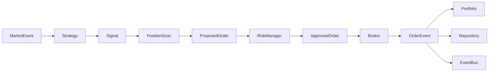

# v0.3 架构

## 核心边界

`TradingEngine` 负责从策略信号到 Broker 的通用链路。它只依赖领域接口和注入对象，不知道 OKX、REST、WebSocket、CLI、环境变量、BTC-USDT 或某个具体策略。

## 三种 Runner

- 回测 Runner：历史 Provider 输入已确认 K 线，信号在下一根 K 线开盘执行，使用 `BacktestBroker`。
- 模拟盘单次评估 Runner：先同步账户和对账，再用 `ReadOnlyBroker` 计算信号、仓位和风控，绝不下单。
- 公共观察 Runner：从公共 WebSocket 接收已确认 K 线，账户风险值未知时按 fail closed 拒绝，使用 `ReadOnlyBroker`。

显式模拟盘订单由 `DemoOrderService` 组装同一个 `TradingEngine`，在确认参数、金额上限、账户同步和前置对账都通过后才注入 `OKXDemoBroker`。

阶段 5 的人工测试订单由 `DemoTradingSession` 管理。启动顺序固定为 REST 账户同步、首次对账、私有 WebSocket 登录和三类订阅确认。任何一步失败都禁止提交；私有账户和持仓推送只保存为暂态，下一次 REST 对账成功后才确认为权威状态。

## TradingSession

`TradingSession` 只处理运行开始与结束审计、异常记录、前后检查和资源关闭。它接受 `SessionRunner`、Repository、EventBus 和 Closable 列表，不导入具体交易所或回测实现。

## Instrument 评审

`Instrument` 保持为不可变、无外部访问的纯领域值对象。它虽然被多个模块使用，但没有配置加载、网络、数据库、Broker、风控或可变状态职责；继续拆分只会增加转换层，因此 v0.2 不拆。

## 基础设施

- REST：`OkxClient`，私有请求固定添加模拟交易头；
- 历史数据：CSV 或 OKX REST Provider；
- 实时数据：OKX 公共 WebSocket Provider，以及受控模拟盘私有 WebSocket Provider；
- 存储：SQLite Repository 和版本化 MigrationManager，保存余额、成本、订单来源和私有暂态快照；
- 事件：内存 EventBus，可注入持久化幂等存储；
- 组装：`app/bootstrap.py`，这是允许知道具体实现的组合根。
