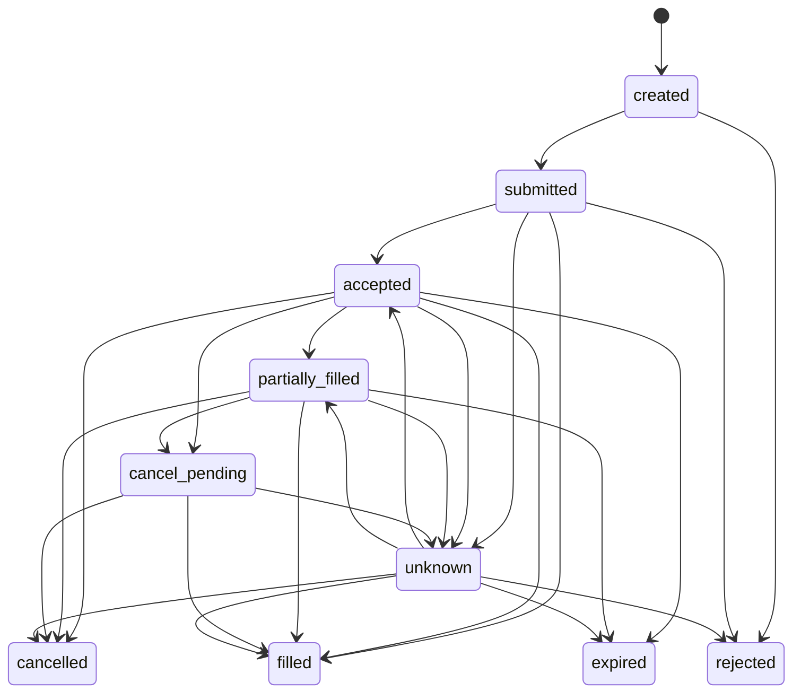

# 订单状态机与幂等

终态是 `filled`、`cancelled`、`rejected` 和 `expired`。Repository 会拒绝终态改变和进度回退。相同状态的重复写入是幂等操作。

模拟盘提交顺序：

1. 保存本地 `created`；
2. 向 OKX 模拟盘提交一次；
3. 保存返回状态；
4. 网络超时只按 `clOrdId` 查询，不重复提交；
5. 查询仍失败时保存 `unknown`；
6. 后续对账持续查询，得到权威终态前禁止新增订单。

幂等键：

- K 线：运行、品种、周期和开盘时间；
- 信号：运行、策略、品种、时间和动作；
- 风控：运行和信号 ID；
- 订单：客户端订单 ID、状态；
- 私有订单推送：客户端订单 ID 和完整规范化消息哈希；
- 成交：本地稳定 ID，OKX 推送优先使用 `tradeId`；
- 账户与持仓：规范化负载哈希。

部分成交只保存本次增量 `fillSz`。相同 `tradeId` 的重放不会再次写入成交；累计成交状态不会直接算作一笔完整闭仓交易。

## 阶段 5 审计字段

订单和每次状态变化都保存运行 ID、环境、策略、品种、周期、信号 ID、交易所订单 ID 与订单来源。来源枚举区分回测、策略模拟、人工模拟测试、保护性退出、对账和旧数据；私有推送与 REST 对账更新订单时，沿用订单最初的业务上下文，不把来源改写成对账。

## 重启恢复

进程重启后先从数据库载入所有非终态订单，再按客户端订单 ID 查询 OKX。查询结果通过同一状态机写入；存在 `unknown`、未确认私有状态或非零衍生品持仓时，新的模拟盘订单继续被拒绝。重启不会重复提交旧订单。
